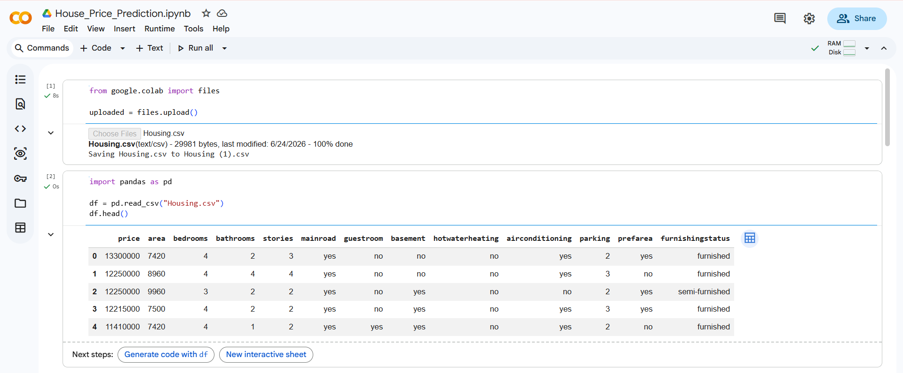
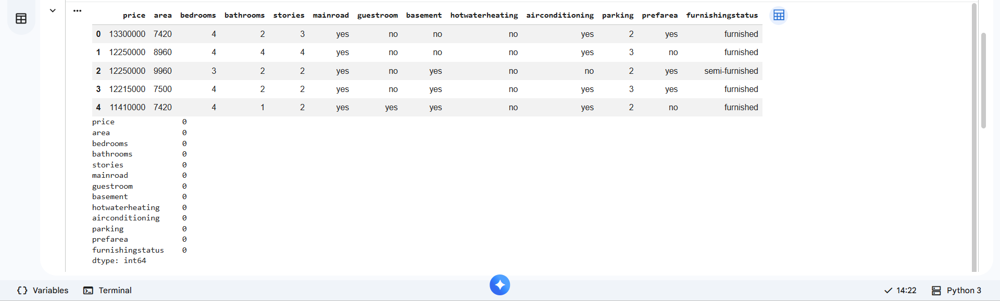
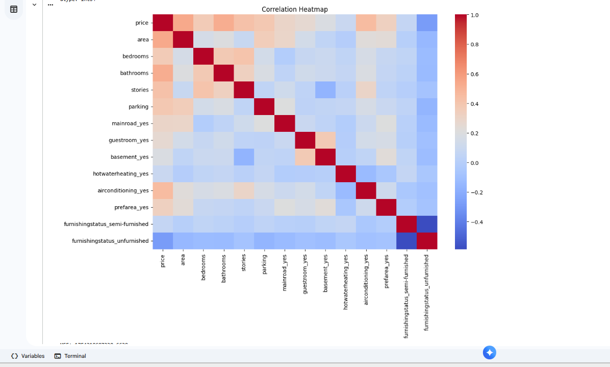
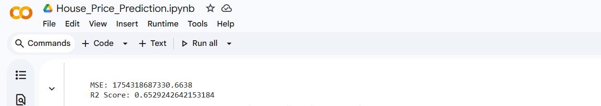
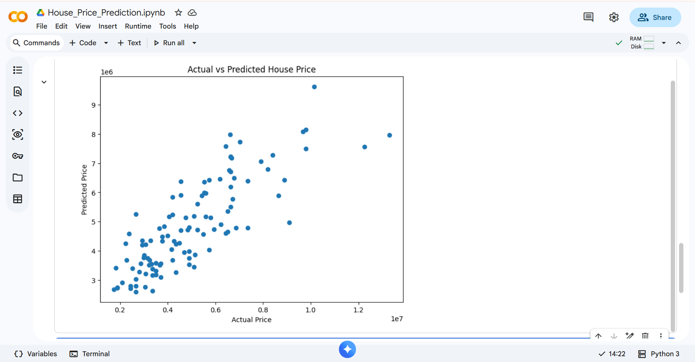

# 🏠 House Price Prediction Using Linear Regression

## 📌 Project Overview
This project focuses on predicting house prices using the Linear Regression Machine Learning algorithm. The model is trained on a housing dataset containing various features such as area, bedrooms, bathrooms, stories, parking, and furnishing status.

This project was completed as part of the **Oasis Infobyte Data Analytics Internship (OIBSIP)**.

---

## 🎯 Objective
To build a predictive model that estimates house prices based on housing features and evaluate its performance using regression metrics.

---

## 🛠️ Tools & Technologies Used
- Python
- Pandas
- NumPy
- Matplotlib
- Seaborn
- Scikit-Learn
- Google Colab

---

## 📊 Dataset Information
The dataset contains housing-related features such as:

- Price
- Area
- Bedrooms
- Bathrooms
- Stories
- Main Road Access
- Guest Room
- Basement
- Hot Water Heating
- Air Conditioning
- Parking
- Preferred Area
- Furnishing Status

---

## 🔍 Project Workflow

### 1. Data Loading
- Imported the housing dataset into Python.

### 2. Data Exploration
- Examined dataset structure and feature information.
- Checked for missing values.

### 3. Data Preprocessing
- Converted categorical variables into numerical format using One-Hot Encoding.

### 4. Exploratory Data Analysis
- Generated a Correlation Heatmap to understand relationships between features.

### 5. Model Building
- Split data into training and testing sets.
- Trained a Linear Regression model.

### 6. Model Evaluation
Evaluated model performance using:

- Mean Squared Error (MSE)
- R² Score

---

## 📈 Results

| Metric | Value |
|----------|----------|
| Mean Squared Error (MSE) | 1754318687330.66 |
| R² Score | 0.653 |

The model explains approximately **65% of the variance** in house prices.

---

## 📷 Project Screenshots

### Dataset Preview


### Missing Values Check


### Correlation Heatmap


### Model Evaluation


### Actual vs Predicted House Price


---

## 🚀 Key Learnings
- Data Preprocessing Techniques
- Feature Encoding
- Correlation Analysis
- Linear Regression Modeling
- Model Evaluation Metrics
- Data Visualization

---

## 📁 Repository Structure

```
OIBSIP_Task6_HousePricePrediction
│
├── House_Price_Prediction.ipynb
├── Housing.csv
├── Dataset_Preview.png
├── Missing_Values_Check.png
├── Correlation_Heatmap.png
├── Model_Evaluation.png
├── Actual_vs_Predicted.png
└── README.md
```

---

## ✅ Conclusion
Successfully developed a Linear Regression model to predict house prices using housing-related features. The project demonstrates the complete machine learning workflow from data preprocessing and visualization to model training and evaluation.

---
### Oasis Infobyte Data Analytics Internship (OIBSIP)
